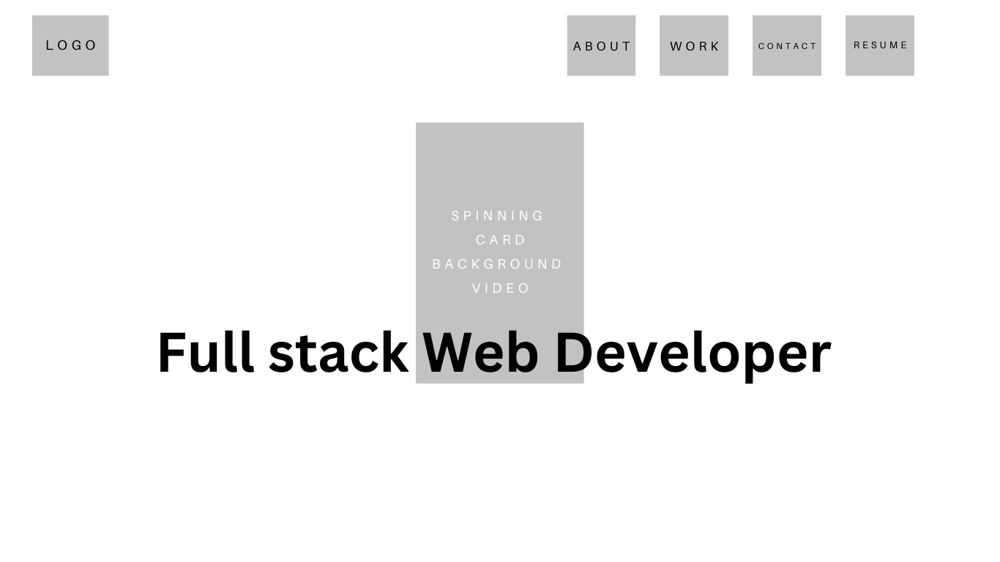
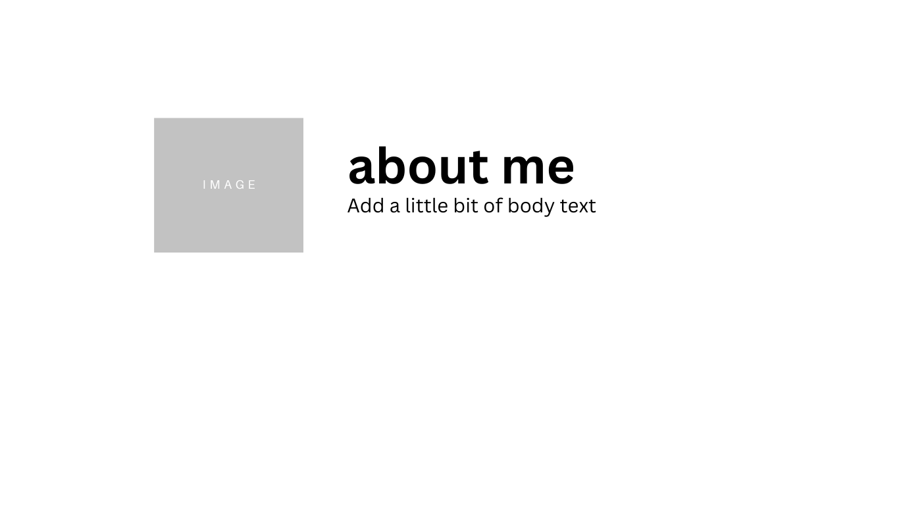
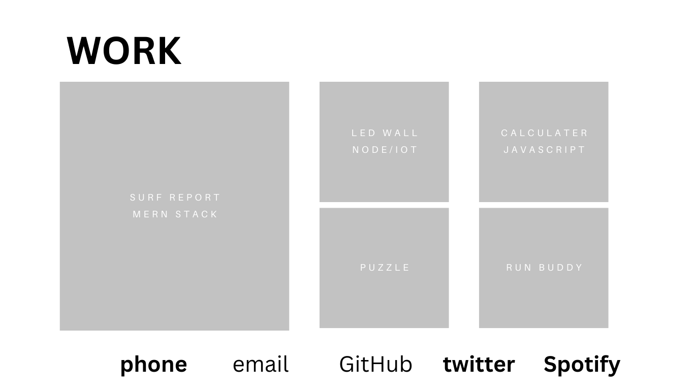

# Professional_Portfolio

## Description

- A portfolio of work that I can showcase my skills and talents to employers looking to fill a part-time or full-time position. 
- set myself up for success by applying the core skills I recently learned: HTML and CSS. 
- An effective portfolio highlights your strongest work as well as the thought processes behind it.
- I learned how web application's appearance and functionality work.

## Mockup

## License

MIT License

---

## Features

- Create hover effect on Image.
- Underline Link Hover Effect

